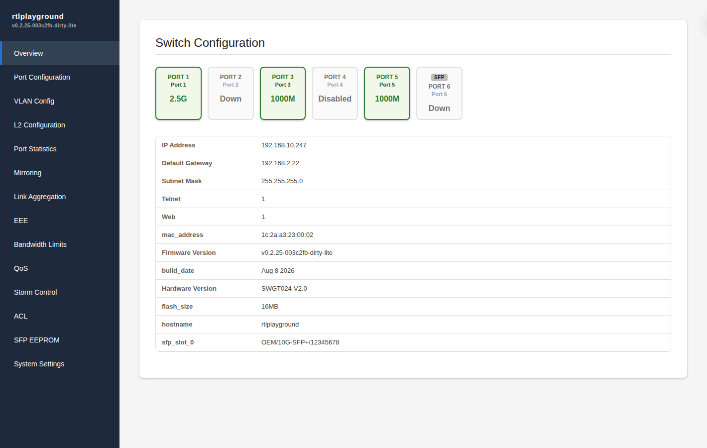

# RTLPlayground
A Playground for Firmware development for advanced user of RTL8372/RTL8373 based 2.5GBit Switches.

For each hardware configuration of these devices, there is usually a managed and an
umanaged version sold, with mostly identical hardware. The aim is to provide management
features also for unmanaged devices with additional features such as Management VLAN,
dhcp servers, multi-language support, IPv6 and TLS-encrypted web-pages. At present, however
only the following features are provided:
- A modern web-interface with mouse-over to display further information
- A serial console (UART) and Telnet interface to configure all features
- CLI commands to save settings to flash (`commit`) and display current config (`show`)
- `ping <ip>` — ICMP echo diagnostics from the switch with RTT statistics
- `show running-config` / `show startup-config` / `show arp` — configuration and ARP-cache inspection
- LLDP (IEEE 802.1AB) neighbor discovery (`lldp on|off|show`)
- IGMP snooping plus the ASIC hardware IGMP/MLD querier (`igmp querier on|off|show`)
- IGMP to configure Multicast streaming
- Port configuration showing detailed informtion about own and Link-partner advertised
  Speed settins and configuration of these settings on the local side
- Per-port configuration of frame sizes (MTUs) for Jumbo-Frame support or limiting MTUs
  for particular devices
- EEE (Energy Efficient Ethernet) can be configured per-port. Detailed information is
  provided for support offered by the link partner and the EEE status of a port.
- VLAN configuration
- SFP information is displayed on the inserted modules, the current sensor values such as
  temperatures, RX and TX power are displayed in the CLI and as mouse-over on the web
- Mirror configuration
- Link Aggregation Groups can be set up
- Detailed information on port packet statistics
- Configuration saved to flash via the web-interface or CLI `commit`
- Firmware updates via the web
- Installation as a firmware upgrade from the original web-interface



The firmware supports all hardware featues of devices with
- 4 2.5GBit ports + 2 SFP+ ports
- 5 2.5GBIT + 1 SFP+ port
- 8 2.5GBit + 1 SFP+ port
Devices sold usually have a fairly common design, however there may be differences in the LED
configuration (switches have LEDs with different colours and use types of LEDs). The list
of tested devices can be found in [Supported devices](doc/supported_devices.md).

To do meaningful development you will need to use a serial console, so soldering skills
are required. Flashing must be done via a SOIC-8 PatchClamp or by soldering a socket
for the flash chip.

If you don't want to open your device, you can use the project's code to learn about the
devices by looking at the image using e.g. Ghidra. If you want to contribute to the
design of the web-interface or get a feeling for the interface first, a standalone
device simulator is provided, which runs entirely under Linux as a local webserver.

## Quick start

```
# 1. Build the firmware (select your machine in machine.h first)
make

# 2. Install it on the switch (web interface or SOIC-8 clip)
#    -> see doc/how-to/installation.md

# 3. The switch defaults to http://192.168.10.247, password 1234

# 4. Operate it with rtlpctl (recommended)
cd tools/rtlpctl && go build -o rtlpctl .
rtlpctl --host 192.168.10.247 --password 1234 info
```

New here? Start with the [Getting started tutorial](doc/tutorials/getting-started.md).

## Tools

The repository ships three tools alongside the firmware:

### rtlpctl — the command-line client (recommended)

`rtlpctl` controls every feature of the switch from the command line,
with host-side validation of all commands (see
[its README](tools/rtlpctl) for the rationale).  It supports one-shot
and interactive modes, an Arista EOS-style CLI mode, and encrypted
operations via the pre-shared key.

```
rtlpctl --host 192.168.10.247 --password 1234 status
rtlpctl --host 192.168.10.247 --password 1234 vlan list
rtlpctl --psk <64-hex> commit
```

### rtlplayground_exporter — Prometheus monitoring

A [Prometheus](https://prometheus.io/) exporter that collects metrics
from the switch's HTTP API (`/status.json`, `/information.json`,
`/counters.json`, ...) and serves them in Prometheus text format at
`/metrics`.  No firmware modification is required.
See [tools/rtlplayground_exporter](tools/rtlplayground_exporter).

### webuitest — WebUI end-to-end tests

A [Playwright](https://playwright.dev/) test suite that drives the Web UI
(log in, navigate every panel, verify there are no console/page errors or
failed requests), against the `httpd_sim` simulator or a real device.
See [tools/webuitest](tools/webuitest).

## Documentation

### Tutorials
- [Getting started](doc/tutorials/getting-started.md)

### How-to guides
- [Compiling the firmware](doc/how-to/compiling.md)
- [Installing the firmware](doc/how-to/installation.md)
- [Serial console and first power-up](doc/how-to/serial.md)
- [Setting up PSK mode](doc/how-to/psk-setup.md)
- [Test IGMP with IP-MC streaming using VLC](doc/how-to/igmp-streaming-test.md)
- [Recode a Fibre Channel SFP module to Ethernet](doc/how-to/sfp-recode.md)
- [Automation](doc/automation.md)
- [Understanding the image with Ghidra](doc/ghidra.md)
- [Modifications and Flash replacement](doc/mods.md)
- [Building without the Web UI](doc/no-web.md)
- [Multi-language support](doc/support-multi-language.md)
- [WebUI performance](doc/webui-performance.md)

### Reference
- [CLI command reference](doc/commands.md)
- [CLI variants: Lite and Full](doc/cli-variants.md)
- [RTL8372/3 feature support](doc/hardware.md)
- [Supported devices](doc/supported_devices.md)
- [Authentication (password vs. PSK mode)](doc/authentication.md)
- [Ping (ICMP echo)](doc/ping.md)
- [LLDP (IEEE 802.1AB)](doc/lldp.md)
- [IGMP (IP-MC streaming)](doc/igmp.md)
- [Storm control](doc/storm-control.md)
- [QoS (802.1p priority)](doc/qos.md)
- [Ingress ACL](doc/acl.md)
- [Bandwidth control](doc/bandwidth.md)
- [CPU Port](doc/CpuPort.md)
- [GPIO pins and registers](doc/gpio.md)
- [L2 learning](doc/l2.md)
- [Link Aggregation](doc/link_aggregation.md)
- [Mirroring](doc/mirroring.md)
- [SFP+ ports](doc/sfp.md)
- [Telnet access](doc/telnet.md)
- [VLAN](doc/vlan.md)

### Explanation
- [Authentication model](doc/authentication.md)
- [Documentation guide](doc/documentation-guide.md)
- [BANK4 creation plan](doc/bank4-plan.md)
- [CLI design (Arista EOS compatibility)](doc/cli-design.md)
- [Assembly memfuncs plan](doc/asm-memfuncs.md)
- [Assembly util plan](doc/asm-util.md)
- [WebUI TypeScript conversion](doc/webui-typescript-conversion.md)

Enjoy playing!
